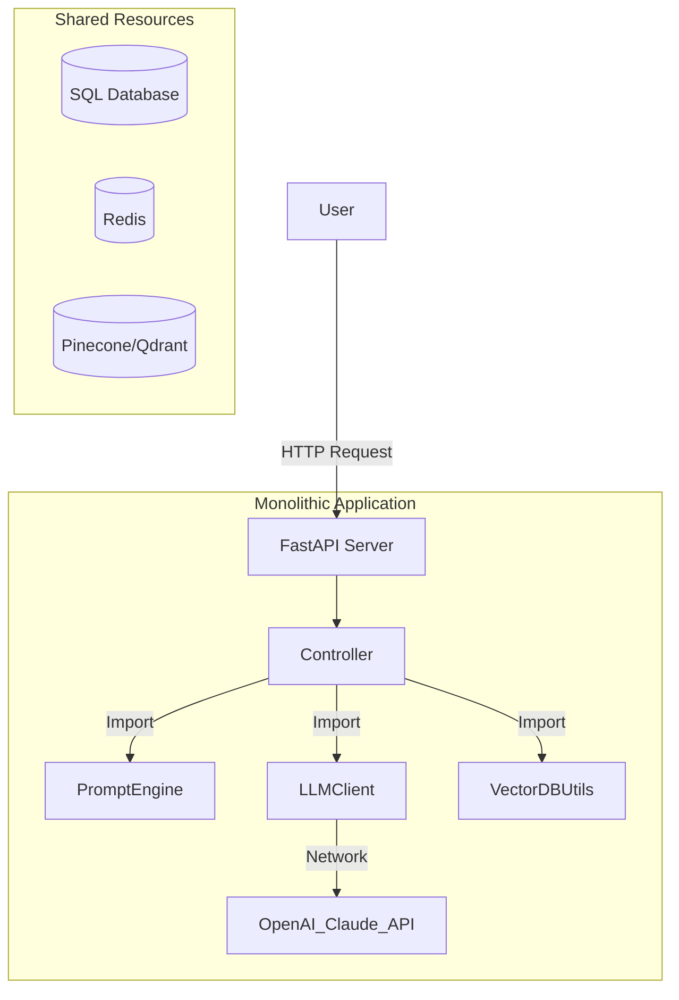
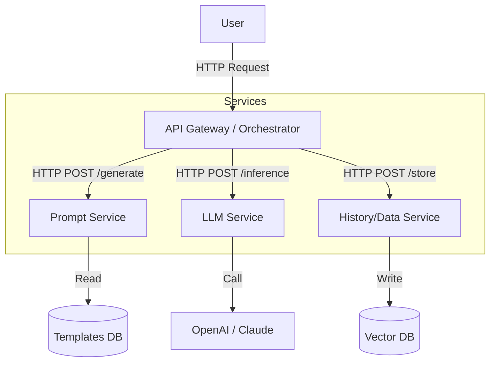
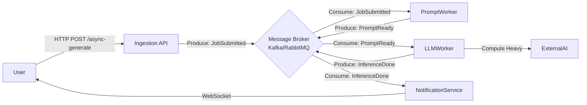

# Event-Driven Microservices & Modern Architectures: A Definitive Guide for AI Engineers

This comprehensive study provides a deep dive into Event-Driven Microservices Architecture (EDMA) and Microservices Architecture (MSA), tailored specifically for AI engineers looking to scale production machine learning systems.

---

## 1. Architectural Deep Dive

### Microservices Architecture (MSA)
**Definition**: An architectural style that structures an application as a collection of loosely coupled, independently deployable services.
*   **Philosophy**: "Do one thing and do it well."
*   **Communication**: typically synchronous (REST/gRPC) or asynchronous.
*   **Data Management**: Database-per-service pattern (decentralized data governance).

### Event-Driven Microservices Architecture (EDMA)
**Definition**: A subset of MSA where services communicate primarily by producing and consuming **events** (state changes) rather than direct requests.
*   **Core Concept**: "Fire and forget." Service A publishes an event ("PromptSubmitted"), and Service B, C, and D react to it independently.
*   **Key Components**: Event Producers, Event Consumers, and Event Channels (Message Brokers like Kafka, RabbitMQ, NATS).
*   **Why for AI?**: specific relevance to AI because LLM inference is slow/blocking. Async event handling prevents timeouts and allows better resource utilization (e.g., queuing GPU jobs).

---

## 2. Comparative Analysis

| Feature | Monolith | Service-Oriented (SOA) | Microservices (MSA) | Event-Driven (EDMA) |
| :--- | :--- | :--- | :--- | :--- |
| **Coupling** | High (Shared processes/memory) | Medium (Shared Enterprise Bus) | Low (API Contracts) | Extremely Low (Decoupled by events) |
| **Scaling** | Scale X-Axis (Clone whole app) | Scale specific heavy services | Scale specific services precisely | Scale consumers based on queue lag |
| **Latency** | Lowest (In-memory calls) | High (ESB overhead) | Medium (Network hops) | Variable (Async eventual consistency) |
| **Complexity** | Low (Single codebase) | High (Enterprise complexity) | Medium-High (Ops complexity) | Very High (Tracing & Consistency) |
| **Best For** | MVPs, Small Teams, Low Latency | Large Enterprise Integrations | Complex Domains, Large Teams | **High Scale AI Pipelines, Streaming** |

### Anti-Patterns (When NOT to use EDMA/MSA)
*   **The "Distributed Monolith"**: Microservices that share a database or rely on tight synchronous chains.
*   **Premature Optimization**: Breaking a simple CRUD app into 10 services before you have users.
*   **Low Latency Requirements**: If you need strict <50ms real-time responses, the hop via a message broker might be too slow.

---

## 3. Project Reconfiguration: Generative AI Project

Below we visually reconfigure the provided `generative_ai_project` into four different paradigms.

### A. Monolithic Architecture
**Concept**: All modules (`llm`, `prompt`, `data`) run in a single process. Simple to deploy, easy to debug.



**Structure**:
```text
generative_ai_project/ (Monolith)
├── config/
│   └── (All configs in one place)
├── src/
│   ├── main.py (Entry point)
│   ├── modules/ (Logical separation only)
│   │   ├── llm/
│   │   ├── prompts/
│   │   └── embeddings/
│   └── shared/ (Utils used everywhere)
└── requirements.txt (Massive list of all dependencies)
```

### B. Microservices Architecture (MSA)
**Concept**: Logic is split into distinct services. The `Orchestrator` (or API Gateway) calls services synchronously via HTTP/gRPC.



**Structure**:
```text
generative_ai_project/ (MSA)
├── services/
│   ├── prompt-service/
│   │   ├── src/
│   │   ├── Dockerfile
│   │   └── api.py (Endpoints: /render-template)
│   │
│   ├── llm-service/
│   │   ├── src/ (Encapsulates API Keys, Retries)
│   │   └── api.py (Endpoints: /completion)
│   │
│   └── knowledge-service/ (RAG & Embeddings)
│       └── ...
└── infra/
    ├── docker-compose.yml
    └── k8s/
```

### C. Event-Driven Microservices Architecture (EDMA) - *Recommended for AI*
**Concept**: Fully async. User submits a job. Services listen for events, process them, and emit new events.
**Flow**: `JobSubmitted` -> `PromptRendered` -> `InferenceCompleted` -> `ResultStored`.



**Structure**:
```text
generative_ai_project/ (EDMA)
├── brokers/
│   └── definitions/ (Protobuf/Avro schemas for events)
│       ├── JobSubmitted.proto
│       └── InferenceCompleted.proto
│
├── services/
│   ├── ingestion-api/ (Lightweight, just pushes to storage + broker)
│   │
│   ├── prompt-worker/ (Consumer)
│   │   ├── handlers.py (msg_handler)
│   │   └── logic/ (Templating logic)
│   │
│   ├── llm-worker/ (Consumer - GPU specialized or API bound)
│   │   ├── handlers.py
│   │   ├── queuing_logic.py (Batching requests)
│   │   └── adapters/ (Claude, GPT implementations)
│
└── config/
    └── shared_events_config.yaml
```

---

## 4. AI/ML Specific Guidance for EDMA

AI workloads differ from standard web apps due to **latency** and **GPU resource scarcity**.

### 1. The "Compute Worker" Pattern
In standard Web Apps, request handling is fast (ms). In AI, it is slow (seconds/minutes).
*   **Pattern**: Do NOT expose LLM inference via synchronous HTTP.
*   **Solution**: Use a Queue (e.g., RabbitMQ, Redis Streams). The API Gateway accepts the request, returns a `job_id`, and the `LLM Service` pulls from the queue only when it has capacity (Semaphore pattern).

### 2. Handling Streaming in EDMA
LLMs often stream tokens. This is hard in pure Event-Driven systems (you don't want 1 event per token).
*   **Hybrid Approach**: Use Events for Job control (Start, Finish, Error) but use **WebSockets** or **gRPC Streams** for the actual token delivery to the frontend, bypassing the message broker for the high-volume token stream.

### 3. Data Gravity & Embeddings
*   **Problem**: Passing large contexts (100k tokens) through a Message Broker (Kafka) is an anti-pattern.
*   **Best Practice**: Pass **References** (Object Storage URIs) in events.
    *   *Bad Event*: `{ "event": "start", "context": " <1MB of text> " }`
    *   *Good Event*: `{ "event": "start", "context_uri": "s3://bucket/prompt_123.txt" }`

---

## 5. Industry Best Practices & Pitfalls

### Best Practices
1.  **Idempotency**: Ensure if an event is delivered twice, the consumer handles it safely (e.g., doesn't bill the user twice or run the LLM twice).
2.  **Schema Registry**: Use Avro or Protobuf. In a distributed system, if the `prompt-service` changes the event format, the `llm-service` must know how to read it.
3.  **Dead Letter Queues (DLQ)**: If the LLM confuses the worker and it crashes, the message must go to a DLQ, otherwise the worker will restart and crash infinitely (Poison Pill).
4.  **Saga Pattern**: For long transactions (e.g., RAG pipeline: Retriever -> Reranker -> Generator). If Reranker fails, you might need to "compensate" (cancel the job status).

### Common Pitfalls
1.  **Over-Architecting**: Using Kubernetes + Kafka for a prototype. Start with a Modular Monolith or coarse-grained services.
2.  **Ignoring Observability**: In EDMA, you cannot simple "look at the stack trace". You need Distributed Tracing (OpenTelemetry, Jaeger) to see the flow of an event across queues and services.
3.  **Synchronous Coupling**: Calling HTTP endpoints from inside an Event Handler. This defeats the purpose of isolation.

---

## 6. Supplemental Knowledge for Proficiency

To truly master this, you should expand your skills in:

1.  **Infrastructure as Code (IaC)**: Terraform/Pulumi. Managing 10 services manually is impossible.
2.  **Container Orchestration**: Kubernetes (K8s) or Serverless (AWS Lambda/Google Cloud Run). K8s is standard for managing microservice sidecars and detailed scaling configuration.
3.  **Observability Stack**:
    *   **Logging**: ELK Stack or Loki.
    *   **Metrics**: Prometheus + Grafana (Track "Queue Depth" and "Token Latency").
    *   **Tracing**: Jaeger/Tempo.
4.  **Protocol Buffers (gRPC)**: For high-performance internal communication between services when events aren't appropriate.

---
